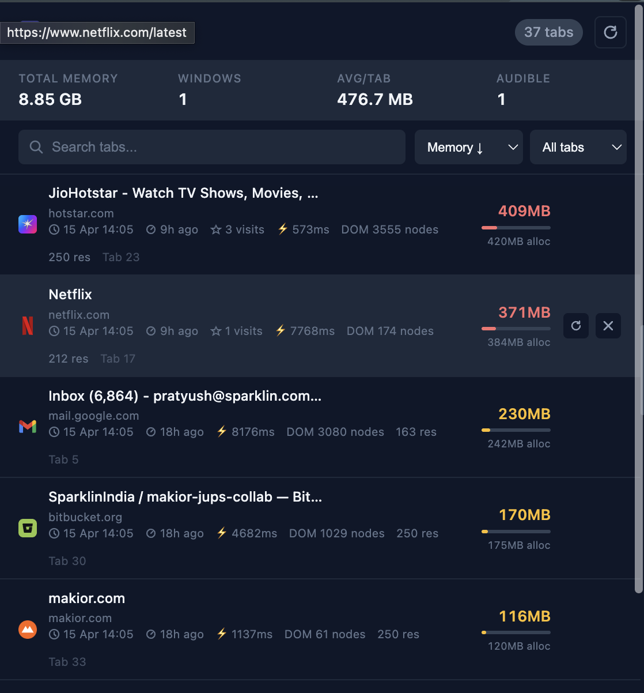

# Tab Inspector 🔍

A Chrome extension that gives you a real-time dashboard of every open tab — memory usage, open time, last activity, DOM stats, and more. Tabs are sorted by memory consumption (highest first) so you can instantly spot what's slowing your browser down.



---

## ⬇️ Download & Install

**No coding needed — just download and load into Chrome:**

1. **[⬇️ Download tab-inspector-v2.1.0.zip](https://github.com/pratyushvidyarthi/tab-inspector/releases/tag/v2.1.0)**
2. Unzip the downloaded file
3. Open Chrome and go to **`chrome://extensions/`**
4. Turn on **Developer mode** (toggle in the top-right corner)
5. Click **Load unpacked** → select the unzipped `tab-inspector` folder
6. Pin the extension from the Chrome toolbar 📌

---

## Features

- **Memory usage** per tab — JS heap used & allocated, with color-coded indicators (green / amber / red)
- **Memory bar** — proportional visual bar relative to the heaviest tab
- **Open time** — when each tab was opened
- **Last active** — how long ago you switched to each tab
- **Visit count** — how many times you've activated each tab
- **DOM stats** — node count, resource count, page load time
- **Status badges** — Active, Pinned, Audio, Muted, Suspended
- **Total memory summary** in the header (all tabs combined, average per tab)
- **Search** — filter tabs by title or URL
- **Sort** — by memory, title, open time, last active, or visit count
- **Filter** — All / Active / Pinned / Audible / Muted / Discarded
- **Close duplicates** — removes tabs with identical URLs in one click
- **Per-tab actions** — reload or close any tab from the panel
- **Multi-window support** — tabs grouped by browser window
- **Auto-refresh** every 30 seconds
- **Dark mode** support

---

## How Memory Collection Works

Tab Inspector uses two methods to collect memory data:

| Method | How | Works on |
|--------|-----|----------|
| `chrome.scripting` + `performance.memory` | Injects a script into the page to read JS heap size | All regular `http/https` pages |
| Chrome Debugger Protocol | Uses `Memory.getDOMCounters` + `Performance.getMetrics` | Fallback for pages where scripting injection fails |

> **Note:** `chrome://` pages (New Tab, Settings, Extensions) always show `—` for memory — Chrome intentionally blocks script injection on internal pages.

> **Note:** The `debugger` permission may briefly show a "Chrome is being debugged" banner while collecting data. This disappears after the data is fetched.

---

## Permissions

| Permission | Why it's needed |
|------------|----------------|
| `tabs` | Read tab titles, URLs, status, and metadata |
| `scripting` | Inject memory measurement script into pages |
| `debugger` | Fallback memory collection via Chrome DevTools Protocol |
| `storage` | Persist tab open times and activity history across sessions |
| `alarms` | Trigger periodic memory refresh every 30 seconds |
| `<all_urls>` | Measure memory on any website you have open |

---

## Project Structure

```
tab-inspector/
├── manifest.json       # Extension config and permissions
├── background.js       # Service worker — tab tracking & memory collection
├── popup.html          # Extension popup markup
├── popup.css           # Styles (supports light/dark mode)
├── popup.js            # Popup logic — rendering, sorting, filtering
├── icons/
│   ├── icon16.png
│   ├── icon32.png
│   ├── icon48.png
│   └── icon128.png
└── README.md
```

---

## Contributing

Pull requests are welcome! Please open an issue first to discuss what you'd like to change.

1. Fork the repository
2. Create your feature branch (`git checkout -b feature/your-feature`)
3. Commit your changes (`git commit -m 'Add some feature'`)
4. Push to the branch (`git push origin feature/your-feature`)
5. Open a Pull Request

---

## License

MIT — see [LICENSE](LICENSE) for details.

---

## Changelog

### v1.1.0
- Added dual memory collection (scripting + debugger protocol)
- Added DOM node count, resource count, and page load time
- Added allocated heap display alongside used heap
- Fixed memory display for stable Chrome (no longer requires Dev/Canary)
- Auto-refresh every 30 seconds

### v1.0.0
- Initial release
- Tab list with memory, open time, last active, visit count
- Search, sort, filter
- Close duplicates
- Multi-window grouping
